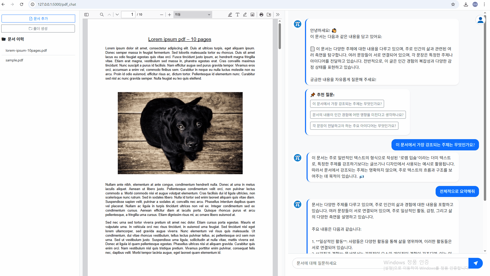

# 📚 DocumentAI

AI 기반 **문서 요약 및 질의응답(Question Answering)** 웹 애플리케이션

> **업로드한 PDF 문서를 자동으로 요약하고, 추천 질문 및 질의응답 기능을 제공하는 서비스입니다.**

---

## 📝 프로젝트 소개

DocumentAI는 사용자가 PDF 문서를 업로드하면  
AI가 문서를 읽고 **주요 내용 요약**과 함께,  
문서에 대해 궁금할 법한 **추천 질문**을 생성해주고  
실시간으로 질의응답까지 지원하는 웹앱입니다.

---

## 🚩 주요 기능

- **PDF 파일 업로드** : 누구나 문서를 올릴 수 있음
- **문서 자동 요약** : GPT 모델 기반 핵심 요약 제공
- **추천 질문 생성** : 문서 특징에 따라 자동 추천 질문 2~3개 제시
- **문서 기반 질의응답(QA)** : AI에게 자연어로 자유롭게 질문 가능
- **챗봇 스타일 UI** : 대화형 인터페이스
- **사용자 인증 및 세션 관리** : (로그인/회원가입 포함 시)
---

## 🛠️ Tech Stack (기술 스택)

### 🤖 AI/언어모델 (LLM)
- **OpenAI GPT-4o-mini** : 문서 요약 및 질의응답에 사용되는 대형 언어 모델(LLM)
- **LangChain** : LLM 파이프라인 설계 및 프롬프트 관리, RAG(검색 증강 생성) 구조 구현

### 🔍 검색/임베딩 (RAG)
- **FAISS** : 문서 임베딩 벡터 저장 및 고속 검색 (유사도 기반 RAG)
- **LangChain Retriever** : 문서 내 유관 문장 추출(Retrieval), LLM과 결합하여 RAG 파이프라인 구현

### 💻 백엔드
- **Python 3.11, Flask** : API 서버, 웹 애플리케이션 백엔드
- **MongoDB, pymongo** : 사용자, 문서, 채팅 데이터 관리

### 🌐 프론트엔드
- **HTML5, CSS3, Bootstrap 5** : 반응형 UI
- **JavaScript, jQuery** : AJAX, 인터랙션
- **Socket.IO (flask-socketio)** : 실시간 채팅/응답 스트리밍

### ⚙️ 기타/배포
- **Gunicorn** : 운영/배포용 WSGI 서버
- **Docker** : 개발/운영 환경 컨테이너화(선택)
- **Python-dotenv** : 환경변수 관리

## 🎬 데모 화면

> 실제 PDF 업로드, 요약, 추천 질문, AI 질의응답 흐름을 한눈에 볼 수 있습니다.

## 🏆 프로젝트 경험/배운점

- LLM 기반 RAG 파이프라인을 처음부터 끝까지 직접 설계·구현하며,  
  실전형 AI 웹서비스 개발 역량을 쌓았습니다.
- 최신 AI/검색 스택(GPT, LangChain, FAISS) 활용 경험,  
  실시간 UX 개선 및 예외 처리 등 실무형 문제해결력을 경험하였습니다.

## 🚀 개선 방향 및 확장 아이디어

- **요약/QA 응답 속도 최적화 및 사용자 대기 경험 개선**  
  (멀티 프로세싱, 캐싱, 실시간 로딩 개선 등)
- **대용량 문서(PDF 100페이지 이상) 처리 성능 강화**
- **PDF 외에도 Word(DOCX), PowerPoint(PPTX), 텍스트 등 다양한 문서 형식 지원 확대**
- **문서 내 이미지/표/차트 등 비정형 데이터 자동 인식 및 요약 기능 확장**
- **사용자별 문서 히스토리, 즐겨찾기, 북마크, 최근질문 등 개인화 기능 추가**
- **모바일·다크모드 등 반응형 UI/UX 고도화**
- **챗 이력 다운로드 및 공유 기능 추가**
- **자체 오픈소스 LLM 적용, 프라이빗 배포 지원 등 인프라 확장**
- **보안·인증(2단계 로그인, 데이터 암호화 등) 강화**

---
